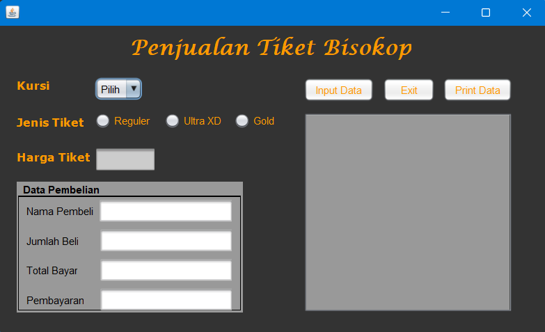

# Cinema Ticket Sales Application

</a>

## Features

- Kursi
- Jenis Tiket
- Harga Tiket
- Data Pembelian
- Input Data, Exit, Print Data

## Tech

Aplikasi ini dirancang menggunakan:

- [Java](https://code.visualstudio.com/docs/editor/vscode-web): Java adalah bahasa pemrograman tingkat tinggi yang bersifat general-purpose, class-based, dan object-oriented. Program yang ditulis dalam bahasa Java dapat dijalankan di berbagai platform tanpa perlu kompilasi ulang.
- [Apache NetBeans](https://netbeans.apache.org/front/main/): Apache NetBeans adalah lingkungan pengembangan terintegrasi (IDE) sumber terbuka yang mendukung pengembangan aplikasi perangkat lunak dengan berbagai fitur untuk berbagai bahasa pemrograman.
